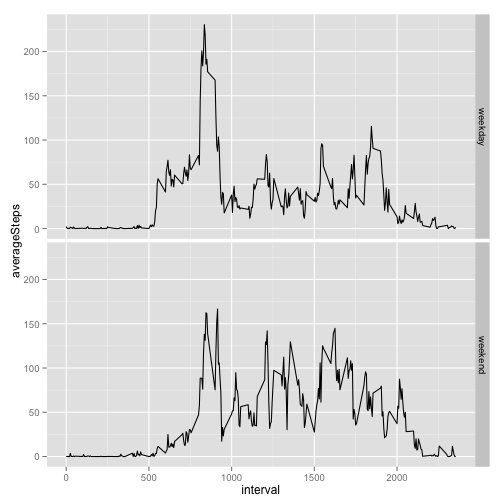

# Reproducible Research: Peer Assessment 1

## Loading and preprocessing the data

Straightforward load of the csv of the data. No need to preprocess at this time.

```r
data <- read.csv('activity.csv')
```


## What is mean total number of steps taken per day?


```r
stepsPerDay <- tapply(data$steps, data$date, sum, na.rm=T)
hist(stepsPerDay, breaks=10)
```

 

```r
mean(stepsPerDay)
```

```
## [1] 9354
```

```r
median(stepsPerDay)
```

```
## [1] 10395
```

## What is the average daily activity pattern?


```r
averageStepsPerInterval <- tapply(data$steps, data$interval, mean, na.rm=T)
interval <- as.integer(names(averageStepsPerInterval))
plot(interval, averageStepsPerInterval, type="l")
```

 


```r
maxAverageInterval <- names(averageStepsPerInterval[averageStepsPerInterval == max(averageStepsPerInterval)])
```

The interval with the maximum average steps is **835**.  

## Imputing missing values

How many missing values are there in the step data?  


```r
sum(is.na(data$steps))
```

```
## [1] 2304
```

Let's fill in some of those values. We'll use the average value in that interval across all days to fill NA values in that interval, creating a new dataset in the process:


```r
dataImputed <- data
dataImputed$steps[is.na(data$steps)] <- averageStepsPerInterval[as.character(data$interval[is.na(data$steps)])]
```

Now we'll take a look at how the data has shifted, computing a histogram of our newly imputed dataset.


```r
stepsPerDayImputed <- tapply(dataImputed$steps, dataImputed$date, sum)
hist(stepsPerDayImputed, breaks=10)
```

 

```r
mean(stepsPerDayImputed)
```

```
## [1] 10766
```

```r
median(stepsPerDayImputed)
```

```
## [1] 10766
```

Looks like all those days will invalid values were pulling down our distribution considerably, though the median remains mostly unchanged.

## Are there differences in activity patterns between weekdays and weekends?

Let's take a look at the data by day of week, specifically how do things look with respect to weekend activity compared to weekdays.


```r
dataImputed$dayOfWeek <- weekdays(as.POSIXct(dataImputed$date))
dataImputed$weekends <- factor(dataImputed$dayOfWeek %in% c("Saturday","Sunday"), labels = c("weekday","weekend"))
aggMeanStepsByInterval <- aggregate(dataImputed$steps, by = list(dataImputed$interval, dataImputed$weekends), FUN=mean)
colnames(aggMeanStepsByInterval) <- c("interval", "weekends", "averageSteps")

library(ggplot2)
qplot(data=aggMeanStepsByInterval, x=interval, y=averageSteps, facets=weekends ~., geom="line")
```

 

It appears there's more activity overall on the weekends, but the biggest peak seems to be during the week.
